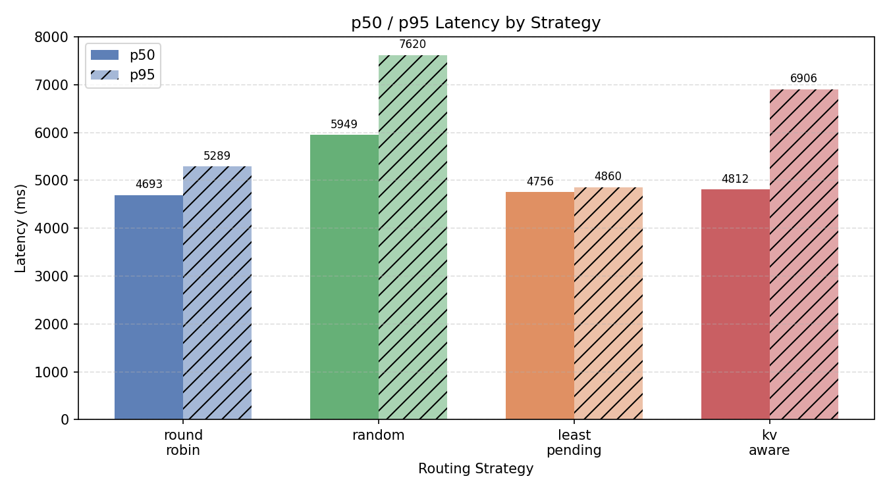
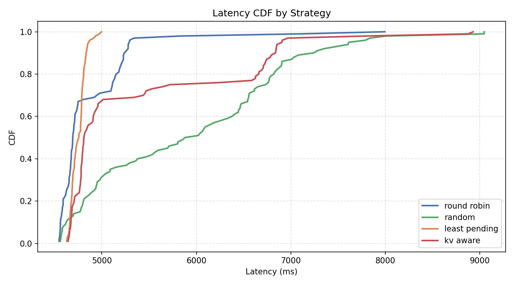
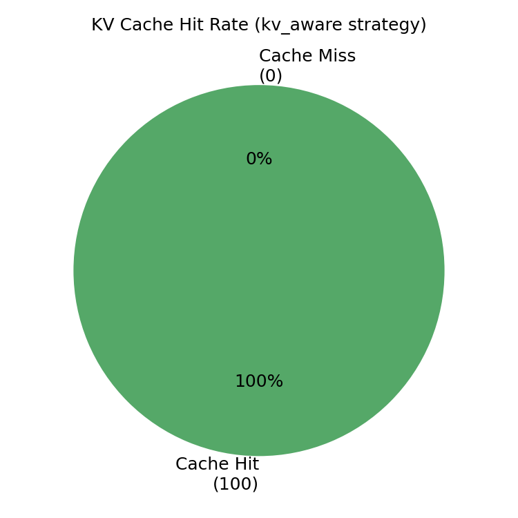
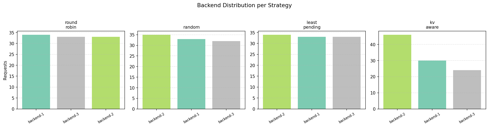
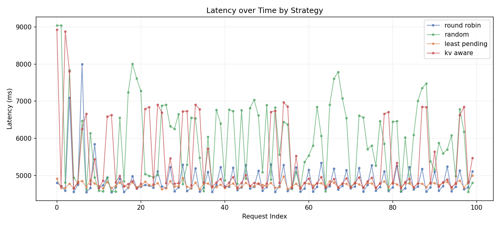

# InferFlow

InferFlow is a scalable LLM inference router centered on a Go control-plane and pluggable routing strategies. It runs on AWS EKS with three llama.cpp backends (Qwen2.5-0.5B-Instruct, CPU-only) and supports four routing strategies switchable at runtime.

## Documentation

Detailed documentation is organized under [docs/README.md](C:/Users/ajinf/Documents/CS%206650/InferFlow/docs/README.md).

Quick links:

- [Overview](C:/Users/ajinf/Documents/CS%206650/InferFlow/docs/overview.md)
- [Local Development](C:/Users/ajinf/Documents/CS%206650/InferFlow/docs/local-development.md)
- [EKS vLLM Deployment](C:/Users/ajinf/Documents/CS%206650/InferFlow/docs/eks-vllm.md)
- [Triton Setup](C:/Users/ajinf/Documents/CS%206650/InferFlow/docs/triton-setup.md)
- [Kubernetes Deployment](C:/Users/ajinf/Documents/CS%206650/InferFlow/docs/kubernetes-deployment.md)
- [Terraform Infrastructure](C:/Users/ajinf/Documents/CS%206650/InferFlow/docs/terraform-infrastructure.md)
- [GitHub Actions](C:/Users/ajinf/Documents/CS%206650/InferFlow/docs/github-actions.md)
- [Destroy Workflow](C:/Users/ajinf/Documents/CS%206650/InferFlow/docs/destroy-workflow.md)

## Load Test Results

Load tests were run against a live AWS EKS cluster (3x c5.xlarge nodes, llama.cpp + Qwen2.5-0.5B-Instruct).

### Strategy Comparison — 100 requests each, 3 concurrent, mixed prompts

| Strategy | p50 (ms) | p95 (ms) | min (ms) | max (ms) |
|---|---|---|---|---|
| round_robin | 4693 | 5296 | 4548 | 7995 |
| **least_pending** | **4757** | **4860** | 4630 | **4995** |
| kv_aware | 4812 | 6906 | 4642 | 8930 |
| random | 5949 | 7789 | 4560 | 9046 |

- `least_pending` wins at scale — tightest p95 (4860ms) and lowest max (4995ms). At 3 concurrent requests across 3 backends it actively avoids overloading a single backend.
- `round_robin` is a close second on p50 but shows higher tail latency (max 7995ms) when backends fall behind.
- `random` is clearly the worst — p50 nearly 1.3s slower than round_robin, max latency over 9 seconds due to random backend collisions.
- `kv_aware` achieves 100/100 Redis cache hits but shows high tail latency (p95 6906ms) because it concentrates repeated prompts on one backend (backend-2 got 46% of traffic), creating a hotspot.

### KV Cache Benefit — repeated long prompt, concurrency 1

This test sent the same 200-token prompt on every other request (`--repeat-factor 2`) and compared `round_robin` vs `kv_aware`.

| Strategy | Repeated prompt avg | Unique prompt avg |
|---|---|---|
| round_robin | 6042ms | 4657ms |
| **kv_aware** | **4708ms** | — |

`round_robin` distributes repeated prompts across all three backends, so each backend recomputes the KV attention from scratch — spiking to 6962ms in the worst case.

`kv_aware` pins each prompt hash to one backend via Redis. That backend already has the KV cache warm from the previous request, so repeated prompts complete as fast as unique ones (4708ms avg vs 4657ms for fresh prompts on round_robin).

### Response Headers

Every response includes:

- `X-Inferflow-Backend` — which backend handled the request (`backend-1`, `backend-2`, `backend-3`)
- `X-Inferflow-Strategy` — active routing strategy
- `X-Inferflow-Cache-Hit` — `true`/`false` (kv_aware only) — whether Redis returned a cached backend for this prompt

### Charts

Generated by `python analysis/charts.py --input results/loadtest.csv --output results/`:

**p50 / p95 Latency by Strategy**


**Latency CDF by Strategy**


**KV Cache Hit Rate (kv_aware only)**


**Backend Distribution per Strategy**


**Latency over Time**


## Current MVP Status

Implemented now:

- Go router with `POST /v1/chat/completions`
- runtime routing strategies: `round_robin`, `least_pending`, `random`, `kv_aware`
- strategy switching through `GET/PUT /strategy`
- metrics endpoint at `GET /metrics`
- mock-backed local development flow
- llama.cpp adapter plus EKS deployment assets
- Redis-backed prompt affinity for kv_aware strategy
- retained Triton code as a deferred backend path

Planned next:

- Streaming SSE responses
- Kubernetes endpoint discovery
- richer Prometheus/Grafana dashboards
- KEDA autoscaling rollout
- AWS Terraform automation

## Local Quick Start

### Option 1: Native processes

Start the mock backend:

```bash
go run ./cmd/mock-backend
```

In another terminal, start the router:

```bash
$env:INFERFLOW_BACKENDS="http://localhost:9000"
go run ./cmd/router
```

Send a sample request:

```bash
curl -X POST http://localhost:8080/v1/chat/completions \
  -H "Content-Type: application/json" \
  -d "{\"model\":\"mock-llm\",\"messages\":[{\"role\":\"user\",\"content\":\"Hello from InferFlow\"}]}"
```

Run tests:

```bash
go test ./...
```

Generate a sample CSV:

```bash
python loadgen/generator.py --requests 5 --output results/sample.csv
```

Run all active strategies locally:

```bash
python loadgen/generator.py --requests 5 --strategies round_robin,least_pending,random,kv_aware --output results/strategies.csv
```

### Option 2: Docker Compose

```bash
docker compose up --build
```

The router listens on `http://localhost:8080` and the mock backend is internal to Compose.

## EKS Terraform Quick Start

```bash
cd terraform/environments/aws
terraform init -backend=false
terraform plan
terraform apply
```

## Router API

### `POST /v1/chat/completions`

Accepts a minimal OpenAI-compatible request body:

```json
{
  "model": "mock-llm",
  "messages": [
    { "role": "user", "content": "Hello" }
  ],
  "stream": false
}
```

Returns a minimal OpenAI-compatible response shape containing:

- `id`
- `object`
- `created`
- `model`
- `choices`
- `usage`

### `GET /healthz`

Returns process liveness.

### `GET /readyz`

Returns success only when at least one backend is currently healthy.

### `GET /metrics`

Returns Prometheus-style router metrics.

### `GET /strategy` and `PUT /strategy`

Supported runtime strategies:

- `round_robin`
- `least_pending`
- `random`
- `kv_aware`

## Infrastructure Note

The active infrastructure path is AWS EKS with llama.cpp backends (3x c5.xlarge nodes). The router is publicly accessible via an AWS ALB. Triton and vLLM adapter code is retained in the repo as deferred backend paths.

## Scripts

- `scripts/local-run.ps1`: starts mock backend and router locally
- `scripts/setup-cluster.sh`: infrastructure and deployment helper notes
- `scripts/teardown-cluster.sh`: destroy helper

Detailed infrastructure, deploy, and destroy docs live under [docs/README.md](C:/Users/ajinf/Documents/CS%206650/InferFlow/docs/README.md).
